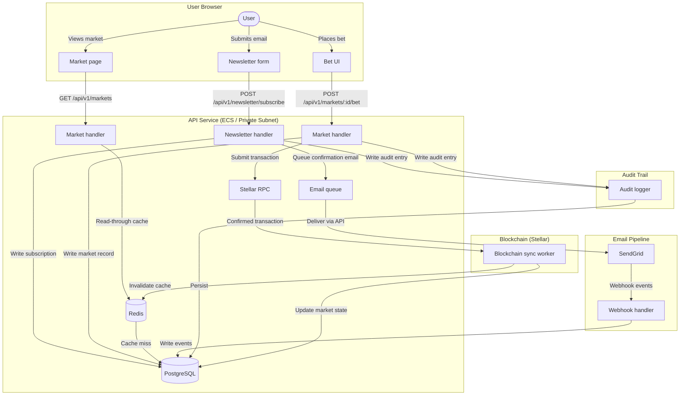

# PredictIQ — Data Flow & Lifecycle

This document describes how each major data type flows through PredictIQ: where it is collected, where it is stored, how long it is retained, how it is deleted, and who has access. It is intended to support GDPR/privacy compliance and internal security reviews.

> **Last reviewed:** 2024-06-01
> **Owner:** Security & Compliance team (`@predict-iq/security-compliance`)
>
> This document is a compliance artifact. It must be re-verified whenever the data model changes. See the [Data Flow Review — PR Checklist](#data-flow-review--pr-checklist) at the end of this document.

---

## Data Flow Overview



---

## Data Types

### 1. Email Addresses (Newsletter Subscribers)

| Attribute | Detail |
|---|---|
| **Collection point** | `POST /api/v1/newsletter/subscribe` — user submits email voluntarily |
| **Storage — primary** | `newsletter_subscribers` table in PostgreSQL (RDS, private subnet) |
| **Storage — cache** | Not cached in Redis |
| **Storage — email processor** | Forwarded to SendGrid for delivery; SendGrid stores message metadata in its own system (see SendGrid DPA) |
| **Retention** | Active subscribers: indefinitely while subscribed. Unsubscribed rows: retained with `unsubscribed_at` timestamp for suppression purposes (prevents re-subscription after unsubscribe). To-be-purged after 2 years from `unsubscribed_at` (policy; implement via scheduled job). |
| **Deletion mechanism** | `POST /api/v1/newsletter/gdpr-delete` hard-deletes the subscriber row and all linked audit entries; confirmation token is invalidated. SendGrid suppression list must be cleared separately via SendGrid API. |
| **Data export** | `GET /api/v1/newsletter/gdpr-export?email=…` returns all stored data fields for the subject. |
| **Who has access** | API service (write/read via service account); DB admin via RDS IAM auth; no direct user read-back of other subscribers |

**Flow:**

```
User → POST /subscribe → [validate email] → newsletter_subscribers (PostgreSQL)
                                          → email_jobs queue → SendGrid → confirmation email
                                          → audit_logs (action=subscribe, actor_ip)
```

---

### 2. Subscription Status

| Attribute | Detail |
|---|---|
| **Collection point** | Set to `confirmed=false` on subscribe; set to `confirmed=true` on `GET /api/v1/newsletter/confirm?token=…` |
| **Storage** | `newsletter_subscribers.confirmed`, `confirmed_at`, `unsubscribed_at` columns in PostgreSQL |
| **Retention** | Lifetime of the subscription record (see above) |
| **Deletion** | Deleted with the parent subscriber row (GDPR delete endpoint) |
| **Who has access** | API service (internal reads for email eligibility checks) |

**States:** `pending_confirmation → confirmed → unsubscribed`

---

### 3. Audit Events

| Attribute | Detail |
|---|---|
| **Collection point** | Written automatically by the audit middleware on every mutating request (`AuditLogger::create_entry`) |
| **Storage** | `audit_logs` table in PostgreSQL |
| **Fields stored** | `action`, `entity_type`, `entity_id`, `actor_email`, `actor_ip`, `reason`, `changes` (JSONB diff), `created_at` |
| **Retention** | Minimum 7 years for financial/compliance events; 2 years for operational events. Retention tiers should be enforced by a scheduled archival job (not yet implemented — see TODO). |
| **Deletion mechanism** | Soft-delete (`deleted_at` column) only. Hard deletes are not performed on audit rows to preserve regulatory trail. GDPR right-to-erasure is satisfied by pseudonymising `actor_email` (replacing with a SHA-256 hash) without deleting the row. |
| **Who has access** | `GET /api/v1/audit/logs` and `GET /api/v1/audit/statistics` — API-key authenticated; API service account (write); DB admin |

---

### 4. Market Data

| Attribute | Detail |
|---|---|
| **Collection point** | Created via internal admin API or smart contract event; updated by blockchain sync worker |
| **Storage — primary** | `markets` table in PostgreSQL (`id`, `title`, `status`, `outcome_index`, `total_volume`, `ends_at`, `created_at`, `resolved_at`) |
| **Storage — cache** | Market lists and detail views cached in Redis under `market:*` keys with configurable TTL (`REDIS_CACHE_TAG_TTL_SECS`); invalidated on market state changes by the blockchain sync worker |
| **Storage — blockchain** | Market outcomes and bet results are immutably recorded on the Stellar (Soroban) contract; this is the authoritative settlement layer |
| **Retention** | Indefinite — market history is required for audit and dispute resolution |
| **Deletion** | Markets are not deleted; they transition to `resolved` or `cancelled` status |
| **Who has access** | Public read (`GET /api/v1/markets`, `GET /api/v1/blockchain/market/:id`); write restricted to service account and blockchain sync worker |

**Flow:**

```
Admin / Contract event
  → POST /api/v1/markets (create)  → markets (PostgreSQL) → Redis (cache invalidated)
  → Blockchain sync worker polls Stellar RPC
      → updates market.status, outcome_index, total_volume in PostgreSQL
      → invalidates Redis cache tags (market_list, market_detail)
```

---

### 5. On-Chain Bets (Stellar / Soroban)

| Attribute | Detail |
|---|---|
| **Collection point** | User submits a signed Stellar transaction via the frontend; API proxies it to Stellar RPC |
| **Storage** | Stellar blockchain (immutable ledger); bet metadata mirrored in PostgreSQL via `blockchain_user_bets` read from contract state |
| **Retention** | Immutable on-chain — cannot be deleted. PostgreSQL mirror retained indefinitely |
| **Deletion** | Not possible for on-chain data. PostgreSQL mirror rows are not deleted |
| **Who has access** | Public on-chain (permissionless read of Stellar ledger); API via Stellar RPC (`GET /api/v1/blockchain/user-bets/:address`); DB admin |

---

### 6. Email Tracking & Delivery Events

| Attribute | Detail |
|---|---|
| **Collection point** | SendGrid posts webhook events (sent, delivered, opened, clicked, bounced, complained, unsubscribed) to `POST /api/v1/email/sendgrid-webhook` |
| **Storage** | `email_jobs` (outbound queue), `email_events` (delivery events), `email_suppressions` (bounces/complaints), `email_analytics` (aggregates) — all in PostgreSQL |
| **Retention** | `email_jobs`: 90 days after completion. `email_events`: 1 year (for deliverability analysis). `email_suppressions`: indefinite (required to prevent re-sending to hard-bounced or complaining addresses). `email_analytics`: indefinite (aggregate, non-personal). |
| **Deletion** | Cascades from `email_jobs` on hard delete (`email_events` cascade). `email_suppressions` cleared only when explicitly re-enabling a suppressed address. |
| **Who has access** | API service (write via webhook); `GET /api/v1/email/analytics`, `GET /api/v1/email/queue-stats`, `GET /api/v1/email/dead-letter` — API-key authenticated |

---

### 7. Analytics Events

| Attribute | Detail |
|---|---|

/* … truncated 3224 chars — edit only what you need near the top … */

---

## Data Flow Review — PR Checklist

This document is a GDPR/privacy compliance artifact and must stay in sync with the actual schema and data-handling behavior. Before merging any PR that touches the items below, update this document and refresh the **Last reviewed** date at the top.

- [ ] **New PII-bearing field or column added** — add or update the relevant Data Type section (collection point, storage, retention, deletion, access).
- [ ] **New table or migration introduced** — verify it against `services/api/database/migrations/*.sql` and document any personal data it stores.
- [ ] **New third-party data sharing** — document the recipient, the data shared, the legal basis, and the applicable DPA.
- [ ] **Retention or deletion behavior changed** — update the retention/deletion rows and note any scheduled jobs that enforce them.
- [ ] **Access controls changed** — update the "Who has access" rows for affected data types.
- [ ] **Last reviewed date refreshed** — set the date at the top of this document to the merge date.

> **CI reminder:** PRs that modify `services/api/database/migrations/**` or add PII-related handlers should be flagged for a data-flow review. Reviewers must confirm this checklist has been completed before approval.
